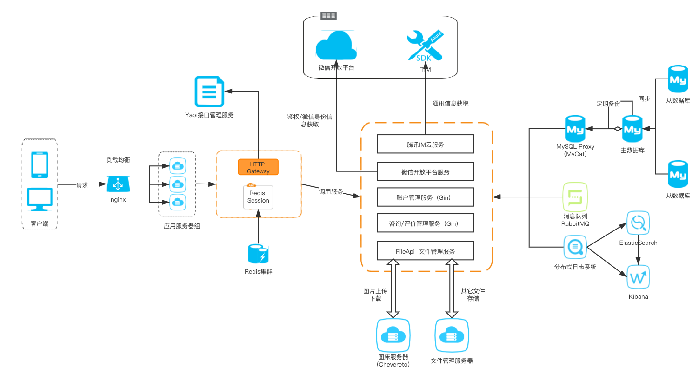
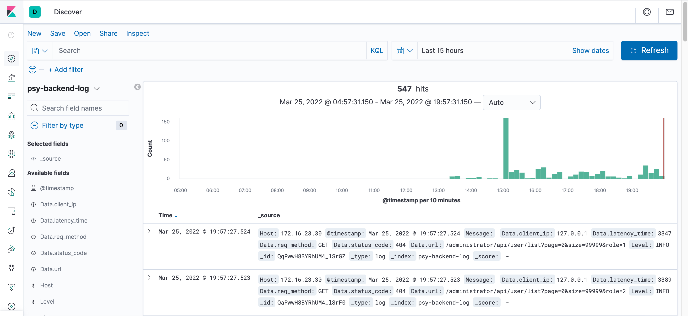

# psy-consult-backend项目（心院咨询热线后端）

## 服务器1配置

服务器ip&port：8.130.13.233:8000

系统信息：Alibaba Cloud Linux 3.2104 64位

系统配置：2 vCPU 2 GiB （I/O优化）ecs.t6-c1m1.large 1Mbps

## 服务器2配置

服务器ip&port：124.221.197.218:8000

系统信息：Centos 8.0 64位

系统配置：2vCPU 4GiB（I/O优化）Tencent Cloud

## 后端整体架构图



## 访问示例

没有申请域名，目前只能通过ip+端口号访问

提供2种请求方式：可以直接访问服务器，也可以通过反向代理服务器访问

### 方式一

**直接访问后端服务器**（<u>目前调试阶段允许这种访问，之后一律走反向代理，拒绝其余请求</u>）

Request：

```
http://8.130.13.233:8000/ping
```

Response：

```json
{
  "code": 0,
  "message": "OK",
  "result": "pong"
}
```

### 方式二

**走反向代理访问后端服务**（无需显式指定端口号）

Request：

```
http://124.221.197.218/ping
```

Response：

```json
{
  "code": 0,
  "message": "OK",
  "result": "pong"
}
```

## Redis集群

由于安全问题，Redis不对公网开放 （docker部署）

服务器ip：8.130.13.233（与服务器ip相同）

Port：6379

用户名：/

密码：/

---

## Chevereto（图床服务）

服务器ip：8.130.13.233（与服务器ip相同）

Port：80

使用教程：https://chevereto-free.github.io/api/#api-key


---

## Elastic Search + Kibana(分布式日志管理服务)

目前仅接入了后端日志，预计之后时间充裕可接入前端以及客户端日志。

服务器ip&port：124.221.197.218:5601



---

## 反向代理与负载均衡

nginx实现

服务器ip&port：124.221.197.218:80

## MySQL

服务器：150.158.159.26:3306

数据库版本：MySQL 8.0

从数据库（备用数据库）：124.221.197.287:3306

已实现主从同步
